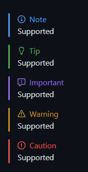

# Markdown It Github Alert

This is a plugin for [Markdown It](https://github.com/markdown-it/markdown-it) Javascript Markdown parser library that adds support for Github style alert boxes.

I want to admit it was really hard to get this working.  Since there is no documentation for plugin development, I had to read the source code of markdown-it and a couple of plugins to understand how to make it work. I hope this plugin will help you to save time.

> [!NOTE]
> GitHub Note Alert Example

> [!TIP]
> GitHub Tip Alert Example

> [!IMPORTANT]
> GitHub Important Alert Example

> [!WARNING]
> GitHub Warning Alert Example

> [!CAUTION]
> GitHub Caution Alert Example

## Installation

With NPM:

```bash
npm install markdown-it-github-alert
```

With Yarn:

```bash
yarn add markdown-it-github-alert
```

## Getting Started

```js
import MarkdownIt from 'markdown-it'
import { alertPlugin } from 'markdown-it-github-alert'

const md = new MarkdownIt()
md.use(alertPlugin) // <-- This is the line that adds the plugin to MarkdownIt

const markdownText = '> [!NOTE]' + '\n> Hello, world'
const result = md.render(markdownText)
console.log(result)

// Output would be:
// <div class="markdown-alert note" dir="auto">
//    <span>
//        <svg class="markdown-alert-icon">
//            ...
//        </svg>
//        Note
//    </span>
//    <p>Hello, world</p>
// </div>
```

### Styling

You can use the following CSS to style the alert boxes:

```css
.markdown-alert {
    padding: 1em;
    border-left: 0.25rem solid;
    padding-bottom: 0px;
    padding-top: 0px;
    border-color: var(--border-color);
}

.markdown-alert > span {
    display: flex;
    flex-direction: row;
    align-items: center;
    color: var(--border-color);
}

.markdown-alert .markdown-alert-icon {
    margin-right: 0.5em;
    fill: var(--border-color);
}

.markdown-alert.note {
    --border-color: #539BF5;
}

.markdown-alert.warning {
    --border-color: #C69026;
}

.markdown-alert.important {
    --border-color: #986EE2;
}

.markdown-alert.caution {
    --border-color: #E5534B;
}

.markdown-alert.tip {
    --border-color: #57AB5A;
}
```

### Result



## How is this plugin working?

Since I couldn't find any documentation for plugin development I would like to explain how this plugin works to help you to understand how to develop your own plugins.

Plugin changes the rule "blockquote" with a new one that supports Github style alert boxes. The new rule is based on the original one, so it supports all the features of the original rule. The only difference is that it detects the first line of the blockquote and adds a metadata to the token. This metadata is used by the renderer to render alert box. If metadata not found, the renderer will render the blockquote as usual.

Check the source code of the plugin for more details.

## Contributing

Pull requests are welcome. For major changes, please open an issue first to discuss what you would like to change. Also, please make sure to update tests as appropriate.

Make sure tests pass before submitting a pull request:

```bash
npm run test
```

## Copyright

This project is licensed under the terms of the MIT License.

You are free to use this project in compliance with the MIT License. If you decide to use, modify, or redistribute this software, you must include a copy of the original license and copyright notice in all copies or substantial portions of the software.

For more information about the MIT License, visit: [MIT License](LICENSE).
